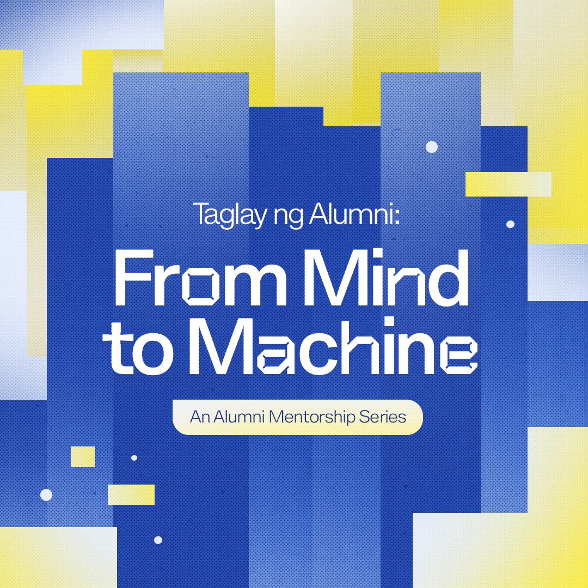
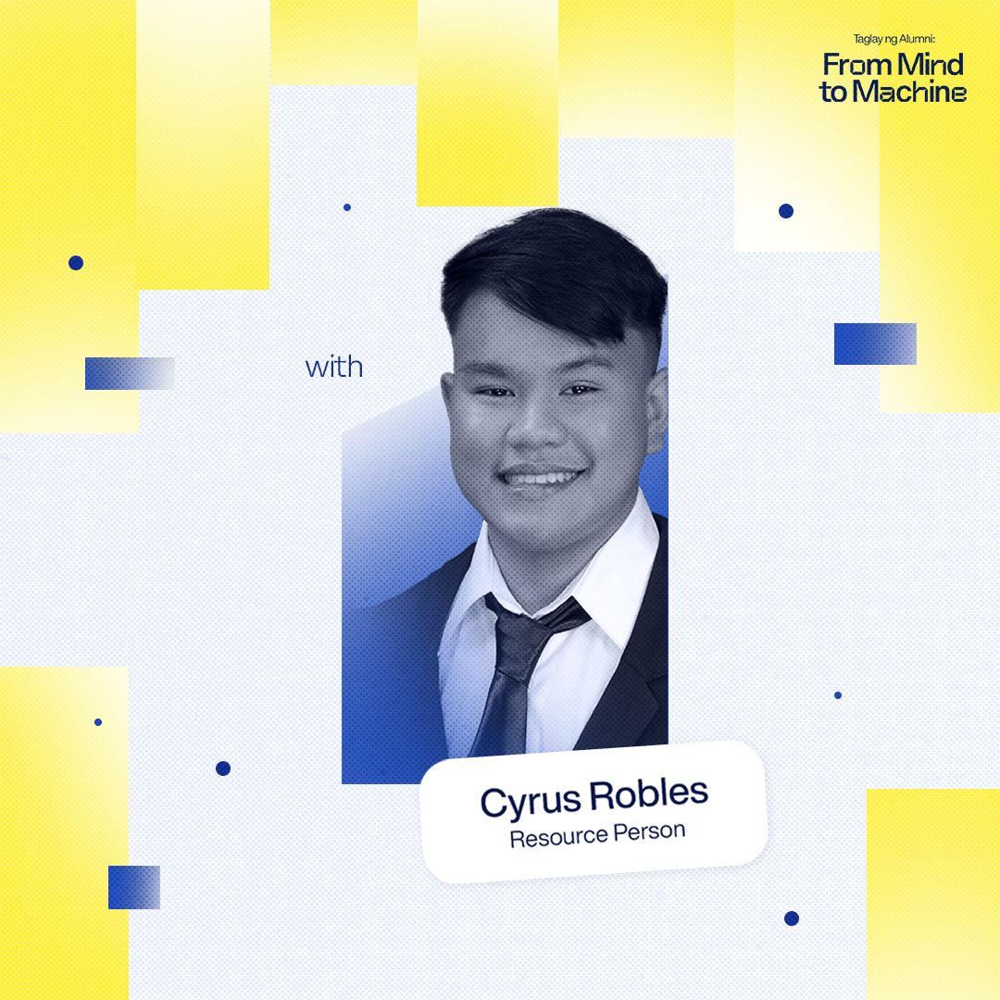

# Taglay ng Alumni: From Mind to Machine

Source code for the “From Mind to Machine” alumni mentorship series site. Built with React + Vite, featuring event highlights, mentor profile, and article-driven content.

## Quick start
- Prerequisites: Node 18+ and npm.
- Install deps: `cd client` then `npm install`
- Run locally: `npm run dev` (visit the printed local URL)
- Production build: `npm run build`
- Preview build: `npm run preview`

## Project structure
- `client/src/pages` – Home, About, Articles, individual article + 404 views.
- `client/src/components` – Navbar, Footer, buttons, and article list cards.
- `client/src/styles` – Component-level styling; global tokens live in `client/src/index.css`.
- `client/public` – Place static assets (event poster/mentor photo) here and reference them in JSX as `/your-file-name.ext`.

## Customizing for the event
- Update hero/event copy in `HomePage.jsx` and `AboutPage.jsx` to reflect the latest schedule, venue, and speakers.
- Swap banner/profile art by adding files to `client/public` and adjusting the `img` `src` paths.
- Tweak color tokens or typography in `client/src/index.css` to match updated branding.
- Edit articles in `client/src/article-content.js` to spotlight session topics or mentor notes.

## Scripts
- `npm run dev` – Start Vite dev server.
- `npm run build` – Create optimized production assets.
- `npm run preview` – Serve the production build locally.

## Notes
- Keep images optimized (e.g., 1600px wide JPG/PNG/WebP) for fast loads.
- If deploying to static hosting (Netlify/Vercel/etc.), build from `client/` and serve the `dist` output. 
